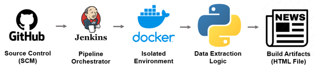

# Daily News Archivist - Automated News Archiving System
## Project Goal

This project is designed to implement a **highly reliable and automated CI/CD Pipeline** for the scheduled acquisition and reporting of daily news from the **Google News RSS Feed (Taiwan)**.

**Key Value Proposition:** Demonstrates proficiency in **CI/CD Best Practices**, **Docker Environment Management**, and **Efficient Data Handling**.

---

## Core Features

* **Pipeline Orchestration:** Workflow fully defined and managed via a comprehensive **Jenkinsfile** (Pipeline as Code).
* **Containerization:** Utilizes **Docker** to ensure an isolated, consistent, and fast execution environment for the Python scraper.
* **Problem Solving:** Leveraged **RSS/XML Parsing** to bypass the instability and performance issues associated with scraping JavaScript-rendered dynamic web pages.
* **Scheduled Automation:** Implemented Cron triggers to run the data collection at a set daily time.
* **Build Artifacts:** Generates visually appealing **HTML Reports** (for human consumption) and raw **CSV data sets** (for analysis).
* **Maintenance:** Configured **Build Discarders** to manage history and optimize disk space on the CI server.

---

## Tech Stack & Architecture

### Dependencies

| Category | Tool | Purpose |
| :--- | :--- | :--- |
| CI/CD | **Jenkins** | Pipeline Orchestration, Scheduling, Artifact Archiving |
| Container | **Docker** | Image Building, Isolated Runtime Environment |
| Language | **Python 3.9+** | Core Logic, Data Transformation |
| Libraries | `requests`, `beautifulsoup4`, **`lxml`** | High-performance XML/RSS Parsing and Data Extraction |

### Execution Flow

---

## Setup & Usage Guide

### Prerequisites

1.  A functioning Jenkins server (Controller/Agent) with Docker installed and the Jenkins user added to the `docker` group.
2.  **Jenkins Plugins:** Pipeline and Docker Pipeline.

### Running the Pipeline

1.  **Create Jenkins Job:** Create a **New Pipeline